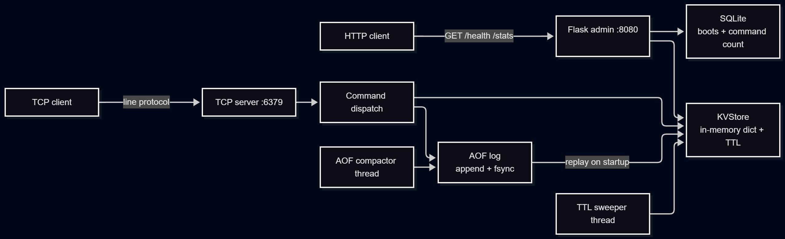

# mini-kv

A small Redis-like key-value store written in Python. It speaks a line-based
TCP protocol, keeps data in memory for fast reads, persists every write to an
append-only log, and exposes a small HTTP admin surface for health and stats.

## Why I built this

I wanted to understand how storage engines work under the hood instead of
just using them. Building a key-value store from scratch is a direct way to
learn about in-memory data structures, concurrency, durability, and crash
recovery.

## What it does

- Line-based TCP protocol on port 6379
- Thread-safe in-memory store with per-key TTL
- Append-only file (AOF) persistence with fsync on every write
- Crash recovery by replaying the log on startup
- Background TTL sweeper that removes expired keys
- Background log compaction that keeps the AOF from growing forever
- HTTP admin sidecar on port 8080 (`/health`, `/stats`)
- SQLite metadata store for boot count and command counter

## Getting started

```bash
python -m venv .venv
source .venv/Scripts/activate    # Windows Git Bash
# or: source .venv/bin/activate  # macOS / Linux
pip install -r requirements.txt
python -m app.server
```

The server listens on 127.0.0.1:6379 for TCP and 127.0.0.1:8080 for HTTP.
Data is written to `data/appendonly.aof`. Metadata lives in `data/metadata.db`.

## Architecture



All of the above runs inside a single Python process. The TCP server and the
Flask admin server share the same `KVStore` instance. Two background threads
run alongside them.

| Component | Role | Runs on |
|---|---|---|
| TCP server | accepts client commands | main thread |
| Flask admin | serves `/health`, `/stats` | background thread |
| TTL sweeper | deletes expired keys | background thread |
| AOF compactor | rewrites the log to its minimal form | background thread |
| KVStore | in-memory data + TTL metadata | shared |
| AOF log | durable write log | shared, on disk |
| SQLite | boot history and command count | shared, on disk |

## Durability design

Every write command (`SET`, `DEL`, `EXPIRE`, `FLUSHALL`) is appended to the
AOF before it is applied to memory.

1. Client sends `SET name alice`
2. Server appends `SET name alice\n` to the AOF and calls `fsync` to force
   it to physical disk
3. Server applies the command to the in-memory dict

If the process is killed between steps 2 and 3, the command is still on
disk. On the next startup the log is replayed and the state is rebuilt
correctly. This is the same core idea behind Redis's AOF mode and every
write-ahead-log-based database.

The trade-off: we fsync on every write for maximum durability, which is
slow. Real systems batch writes over a short window (Redis has
`appendfsync everysec`) to trade a small durability window for much higher
throughput.

### Log compaction

Without compaction the log grows forever. `SET a 1`, `SET a 2`, up to
`SET a 1000` writes one thousand lines even though only the last one
matters. A background thread periodically rewrites the AOF to its minimal
form: one `SET` per live key, plus `EXPIRE` for any key with a TTL. The
rewrite is atomic (write to a `.tmp` file, then `os.replace`).

### TTL sweeping

Expired keys are removed two ways:

- Lazily, on read. If a key is past its expiry it is deleted before
  returning `(nil)`.
- Proactively, by a background thread that calls `sweep_expired()` every
  second. Keys are removed even if they are never read again.

This combination matches how Redis handles expiration in production.

## Talking to the server

### TCP

```bash
python -c "
import socket
s = socket.create_connection(('127.0.0.1', 6379))
for cmd in ['PING', 'SET name alice', 'GET name', 'TTL name', 'EXPIRE name 10', 'TTL name', 'QUIT']:
    s.sendall((cmd + '\n').encode())
    print(cmd, '->', s.recv(1024).decode().strip())
s.close()
"
```

Output:

```
PING -> PONG
SET name alice -> OK
GET name -> alice
TTL name -> -1
EXPIRE name 10 -> 1
TTL name -> 9
QUIT -> OK
```

### HTTP admin

```
GET http://127.0.0.1:8080/health
{"status": "ok", "uptime_seconds": 12.3}

GET http://127.0.0.1:8080/stats
{"uptime_seconds": 12.3, "keys": 3, "boots": 2, "commands": 47,
 "aof_path": "./data/appendonly.aof"}
```

## Crash recovery demo

1. Start the server with `python -m app.server`
2. In another terminal, send `SET name alice` and `SET city nairobi`
3. Kill the server with `Ctrl+C`
4. Restart it. The logs will show `replayed 3 commands from AOF`
5. `GET name` returns `alice`. The data survived.
6. `http://127.0.0.1:8080/stats` shows `boots: 2`. The metadata survived too.

## Protocol

Line-based, one command per line, newline-terminated.

| Command | Response | Notes |
|---|---|---|
| `PING` | `PONG` | health check |
| `SET key value` | `OK` | stores a string, logged |
| `GET key` | value or `(nil)` | |
| `DEL key` | `1` or `0` | 1 if the key existed, logged |
| `EXPIRE key seconds` | `1` or `0` | set TTL, logged |
| `TTL key` | seconds, `-1`, or `-2` | `-1` = no expiry, `-2` = missing |
| `KEYS` | space-separated list | |
| `FLUSHALL` | `OK` | wipes everything, logged |
| `QUIT` | `OK` | closes the connection |

Errors come back as `ERR <message>`.

## Tests

```bash
pytest
```

Thirteen tests cover the in-memory store, TTL behavior, the sweeper, AOF
append and replay, compaction, crash-recovery simulation, and the Flask
admin endpoints.

## Project layout

```
mini-kv/
├── app/
│   ├── server.py        TCP server, dispatch, background threads
│   ├── protocol.py      parse commands, encode responses
│   ├── store.py         thread-safe in-memory KV engine
│   ├── persistence.py   append-only log, replay, rewrite, compact
│   ├── ttl.py           background TTL sweeper thread
│   ├── admin.py         Flask admin HTTP sidecar
│   ├── db.py            SQLite metadata
│   └── config.py        env-based settings
├── tests/
├── docs/
├── scripts/
└── requirements.txt
```

## License

MIT